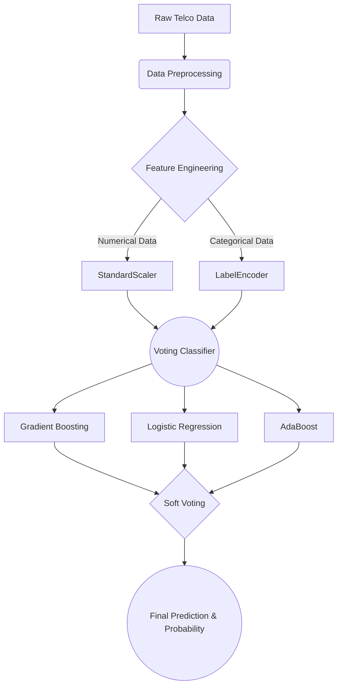
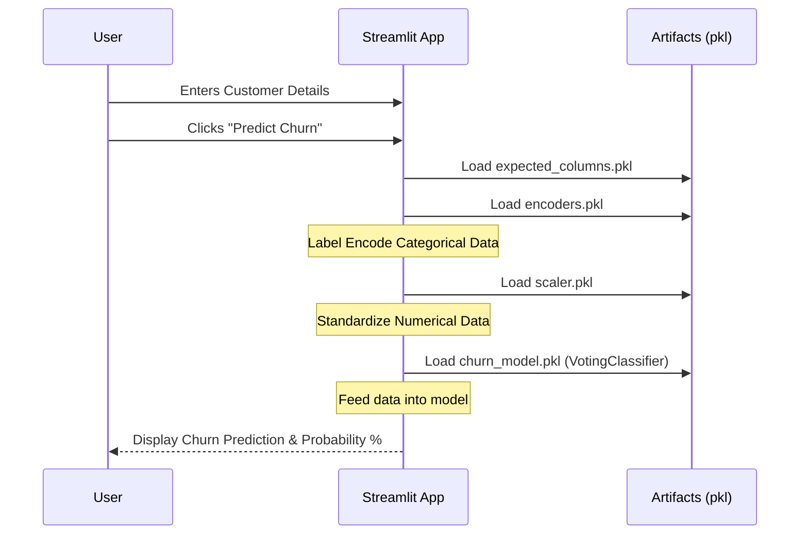

# Customer Churn Prediction 📊

[](https://manishmu632.streamlit.app/)

Welcome to the **Customer Churn Prediction** project! This repository contains an end-to-end Machine Learning pipeline that predicts whether a customer is likely to churn (leave a service) based on their demographic profile, account details, and service usage.

**Live Application:** [https://manishmu632.streamlit.app/](https://manishmu632.streamlit.app/)

---

## 🚀 Project Overview

Customer churn is a critical metric for subscription-based businesses. By identifying customers who are at high risk of leaving, businesses can proactively engage with them through targeted retention strategies.

This project leverages the **Telco Customer Churn** dataset to train a robust ensemble Machine Learning model (`VotingClassifier`). We then serve this model via an interactive web application built with **Streamlit**, allowing users to input customer parameters and receive real-time churn probability predictions.

---

## 🧠 The Machine Learning Model

To achieve high accuracy, we combine three powerful classification algorithms into a single **Soft Voting Classifier**:

1.  **Gradient Boosting Classifier**: Builds a series of weak decision trees sequentially, where each new tree corrects the errors of the previous ones.
2.  **Logistic Regression**: A linear model that estimates the probability of a binary response based on one or more predictor variables.
3.  **AdaBoost Classifier**: Fits a sequence of weak learners on repeatedly modified versions of the data.

### How the Model Works



### Soft Voting Calculation
In "soft voting," the final prediction is made by averaging the predicted probabilities of each individual model.

$$ P(Churn) = \frac{P_{GradientBoosting} + P_{LogisticRegression} + P_{AdaBoost}}{3} $$

If the average probability $P(Churn) > 0.5$, the customer is classified as **Churn (Yes)**. Otherwise, they are classified as **Stay (No)**.

---

## ⚙️ Input Parameters

The model evaluates a customer based on 19 distinct features divided into three categories:

### 1. Demographics
| Parameter | Type | Description |
| :--- | :--- | :--- |
| **Gender** | Categorical | Male or Female |
| **Senior Citizen** | Categorical | Whether the customer is a senior citizen (Yes, No) |
| **Partner** | Categorical | Whether the customer has a partner (Yes, No) |
| **Dependents** | Categorical | Whether the customer has dependents (Yes, No) |

### 2. Services
| Parameter | Type | Description |
| :--- | :--- | :--- |
| **Phone Service** | Categorical | Whether the customer has a phone service (Yes, No) |
| **Multiple Lines** | Categorical | Whether the customer has multiple lines (Yes, No, No phone service) |
| **Internet Service** | Categorical | Customer's internet service provider (DSL, Fiber optic, No) |
| **Online Security** | Categorical | Whether the customer has online security (Yes, No, No internet service) |
| **Online Backup** | Categorical | Whether the customer has online backup (Yes, No, No internet service) |
| **Device Protection** | Categorical | Whether the customer has device protection (Yes, No, No internet service) |
| **Tech Support** | Categorical | Whether the customer has tech support (Yes, No, No internet service) |
| **Streaming TV** | Categorical | Whether the customer has streaming TV (Yes, No, No internet service) |
| **Streaming Movies** | Categorical | Whether the customer has streaming movies (Yes, No, No internet service) |

### 3. Account & Billing Details
| Parameter | Type | Description |
| :--- | :--- | :--- |
| **Tenure** | Numerical | Number of months the customer has stayed with the company |
| **Contract** | Categorical | The contract term (Month-to-month, One year, Two year) |
| **Paperless Billing** | Categorical | Whether the customer has paperless billing (Yes, No) |
| **Payment Method** | Categorical | The customer's payment method (Electronic check, Mailed check, Bank transfer, Credit card) |
| **Monthly Charges** | Numerical | The amount charged to the customer monthly |
| **Total Charges** | Numerical | The total amount charged to the customer |

---

## 🛠️ Application Architecture

The Streamlit web application operates using the pre-trained artifacts to ensure blazing-fast inference times.



---

## 💻 Local Installation & Setup

If you wish to run this project locally on your machine, follow these steps:

### Prerequisites
- Python 3.12+
- Git

### Installation

1. **Clone the repository:**
   ```bash
   git clone https://github.com/your-username/customer-churn-prediction.git
   cd customer-churn-prediction
   ```

2. **Create a virtual environment (Recommended):**
   ```bash
   python -m venv venv
   # On Windows:
   .\venv\Scripts\activate
   # On Mac/Linux:
   source venv/bin/activate
   ```

3. **Install dependencies:**
   ```bash
   pip install -r requirements.txt
   ```

4. **Train the Model (Optional):**
   *If you want to retrain the model from scratch, ensure you have the `WA_Fn-UseC_-Telco-Customer-Churn.csv` dataset in the root directory.*
   ```bash
   python train_model.py
   ```
   *(This will generate the required `.pkl` files).*

5. **Run the Streamlit App:**
   ```bash
   python -m streamlit run streamlit_app.py
   ```

6. Open your browser and go to `http://localhost:8501`.

---

## 📁 Repository Structure

```text
customer-churn-prediction/
│
├── .streamlit/                 # Streamlit configuration folder
├── WA_Fn-UseC_-Telco-Customer-Churn.csv  # Original Dataset (Not tracked in git usually)
├── customer-churn-prediction.ipynb       # Jupyter Notebook containing EDA and Model experimentation
├── train_model.py              # Python script to train and export the model and encoders
├── streamlit_app.py            # Main Streamlit web application
├── requirements.txt            # Python dependencies
├── churn_model.pkl             # Exported VotingClassifier model
├── encoders.pkl                # Exported LabelEncoders for categorical data
├── scaler.pkl                  # Exported StandardScaler for numerical data
├── expected_columns.pkl        # Exported column list to ensure input structure
└── README.md                   # Project documentation
```